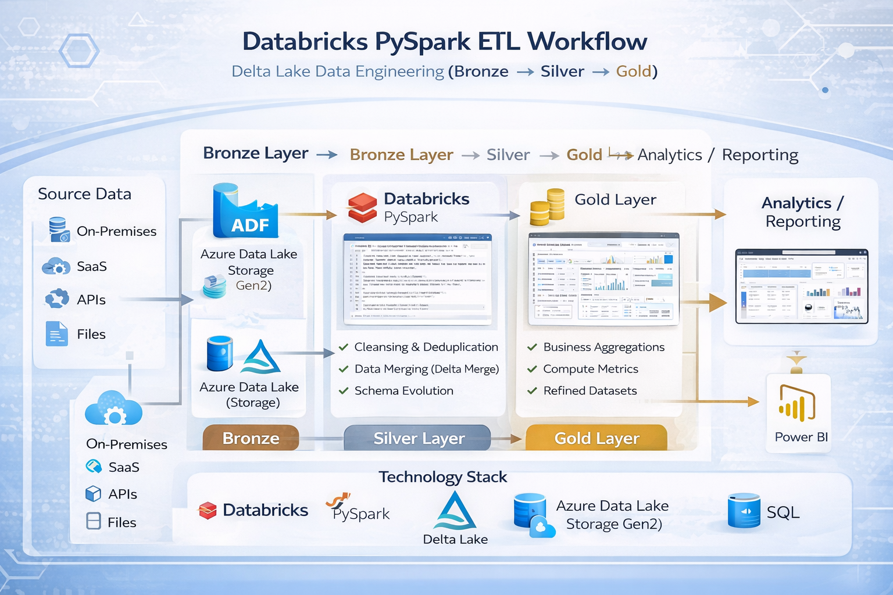

# Databricks PySpark ETL Pipeline

## Architecture Diagram

This project demonstrates a scalable ETL pipeline built using Azure Databricks and PySpark for processing large-scale structured and semi-structured datasets.

The pipeline follows Medallion Architecture (Bronze → Silver → Gold) using Delta Lake storage for reliability and performance.

---

## Architecture Flow

Source Data
→ Bronze Layer (Raw Ingestion)
→ Silver Layer (Data Cleansing & Transformation)
→ Gold Layer (Business Aggregations)
→ Analytics / Reporting

---

## Key Features

✔ Distributed data processing using PySpark  
✔ Delta Lake storage optimization  
✔ Incremental data processing  
✔ Schema evolution support  
✔ Partitioning strategy for performance tuning  

---

## Technology Stack

Azure Databricks  
PySpark  
Delta Lake  
Azure Data Lake Storage Gen2  
SQL  

---

## Use Case Scenario

Designed to ingest raw enterprise datasets, perform transformation and cleansing operations, and generate curated datasets for downstream analytics and reporting workloads.
